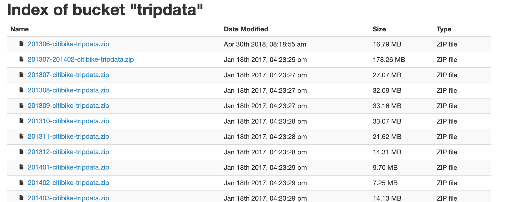
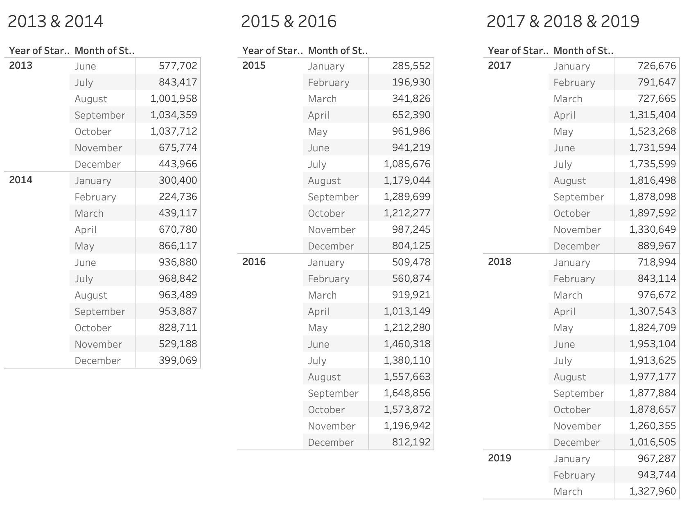

# citi-bike-nyc-data-analysis


City Bike Data Analysis with Tableau, MySQL and Python


## Proyect scope

To analyze information from citi bike nyc trips from 2013 to 2019 in order to find useful insights of the use of the service.


## Proyect Plan

1. Data Download.
2. Data load into MySQL.
5. Building Report with Tableau.

---

## Data Download.

To download the information I went to the official CitiBike webpage and clicked "Download" to all the files available [System Data](https://www.citibikenyc.com/system-data), honestly it was faster than I though..

[Downloadble tripdata data](https://s3.amazonaws.com/tripdata/index.html)



I was wondering that it at some time if there was a way to download all the files using a recursive function.. (just like Zucks @ Social Network)

---

## Data load into MySQL

### Create the table where the info will be stored:

In order to create the table where the data will live I developed this SQL script (**create_db_schema.sql**):

```sql
CREATE DATABASE IF NOT EXISTS citybike_db;

use citybike_db;

drop table IF EXISTS d_trips;

CREATE TABLE d_trips (
  tripduration bigint,
  starttime datetime,
  stoptime datetime,
  start_station_id int,
  start_station_name varchar(100) ,
  start_station_latitude double,
  start_station_longitude double,
  end_station_id int,
  end_station_name varchar(100),
  end_station_latitude double ,
  end_station_longitude double,
  bikeid bigint,
  usertype varchar(50),
  birth_year varchar(50),
  gender int
);

```

What this does is to create the exact table that will contain all the Trip information.


### Load all the files into the database

To load all the files into the database I created a Python script to load one by one all the files to the database:

Import al the dependencies:
```python
import pandas as pd
import sqlalchemy
from sqlalchemy import create_engine
import os

from pandas.io import sql

from pandas import DataFrame


import mysql.connector
from mysql.connector import Error
from mysql.connector import errorcode

```


Import the database password:
```python
from config import database_username
from config import database_password
```

Read all the file names to be loaded and store them in a List:

```python
pwd = os.getcwd()
#print(pwd)
pwd = pwd + '/data/csv'
#print(pwd)


for path, folders, files in os.walk(pwd):
   ## just rename folders inside path 
    if pwd == path:
        #print(path)
        #print(folders)
        print(files)
print(type(files))
print(len(files))

# Sort all files
files.sort()
```

Connect to the database and create the database if it doesn't exist (IDK if that will work if the DB doesn't exist.. I didn't test it..lol):
```python
database_ip       = '127.0.0.1'
database_name     = 'citybike_db'

mydb = mysql.connector.connect(
  host=database_ip,
  user=database_username,
  passwd=database_password
)

mycursor = mydb.cursor()

mycursor.execute("CREATE DATABASE IF NOT EXISTS citybike_db;")

mydb.close()
```

Create a SQLALCHEMY connection:
```python
database_connection = sqlalchemy.create_engine('mysql+mysqlconnector://{0}:{1}@{2}/{3}'.format(database_username, database_password, database_ip, database_name))
```


Run the **create_db_schema.sql**:
```python

# Open and read the file as a single buffer
fd = open('create_db_schema.sql', 'r')
sqlFile = fd.read()
fd.close()

# all SQL commands (split on ';')
sqlCommands = sqlFile.split(';')


try:
    print('[#########] Running the create_db_schema.sql script')
    
    conn = mysql.connector.connect(host=database_ip,
                             database=database_name,
                             user=database_username,
                             password=database_password)
    cursor = conn.cursor()
    
    for command in sqlCommands:
        try:
            cursor.execute(command)
            #print(command)
        except Exception as e:
            print(f'Error detected: ', str(e))
            
    print('[#########] create_db_schema.sql script ran succesfuly')
    
except Exception as e:
        print(f'Error detected: ', str(e))
finally:
    #closing database connection.
    if(conn.is_connected()):
        conn.close()
        print('[#########] MySQL connection is closed')

```

Load file by file into the database:
```python
for file in files:
    

    tripdata_file = file
    
    print(f'[#########] Loading {tripdata_file}....')
    
    df = pd.read_csv("data/csv/"+ tripdata_file)
    
    df.columns = ['tripduration','starttime','stoptime','start_station_id','start_station_name','start_station_latitude','start_station_longitude','end_station_id','end_station_name','end_station_latitude','end_station_longitude','bikeid','usertype','birth_year','gender']
    
    df['starttime'] = pd.to_datetime(df['starttime'])
    df['stoptime'] = pd.to_datetime(df['stoptime'])

    cargar_de = 10000 

    indexx = 0
    limit = len(df)

    while (indexx<=limit):

        final =  indexx + cargar_de

        try:
            #print(f'[#########] Saving from index {indexx} to {final}.')
            df.iloc[indexx:final].to_sql(name='d_trips', con=database_connection, if_exists='append', index=False) 

        except Exception as e:
            print(f'Error detected in file', str(e))

        indexx = indexx + cargar_de

    print(f'[#########]  Data saved.')
```

### Validate dataload with Tableau:



---

## Building Report with Tableau